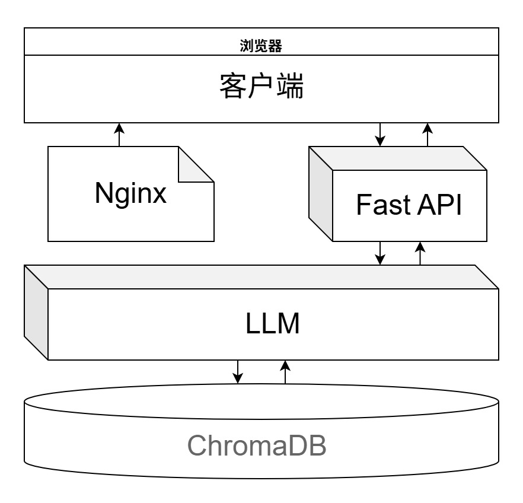
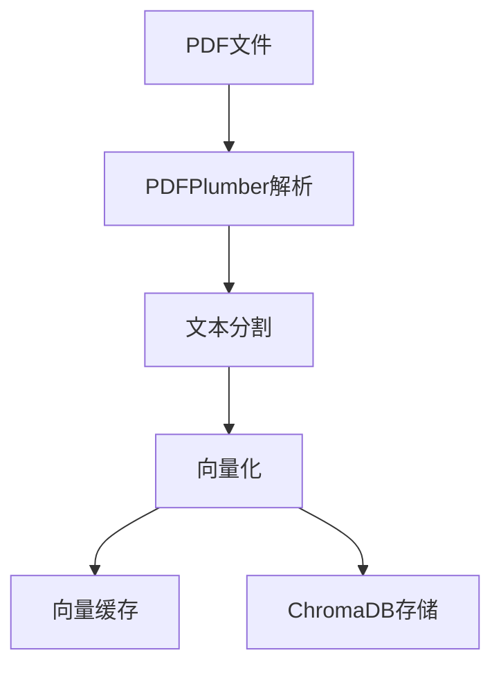
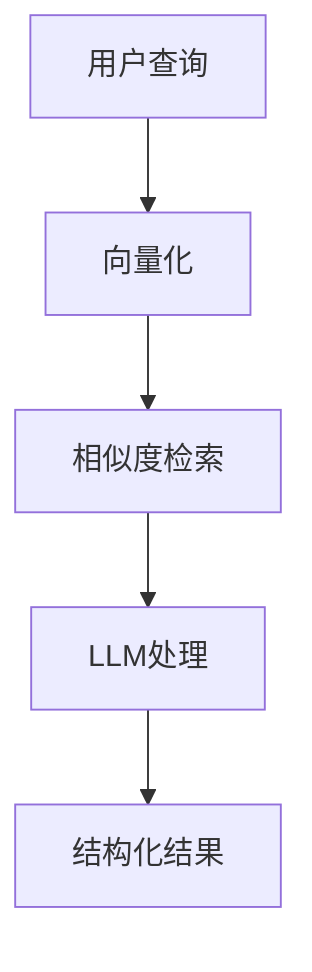
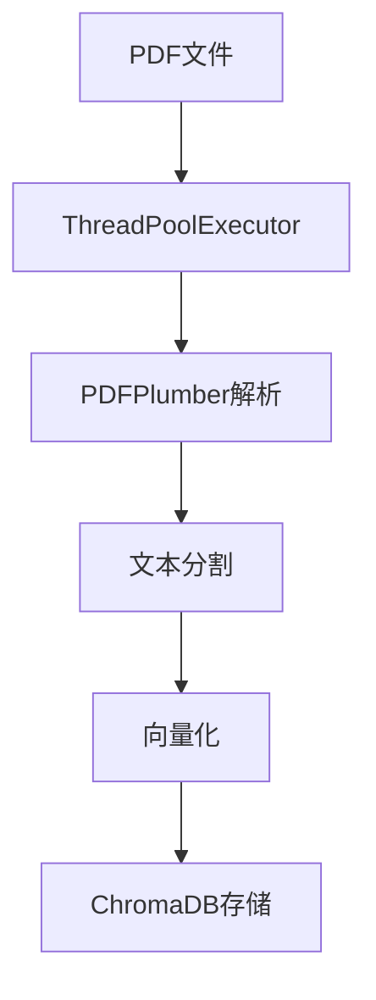
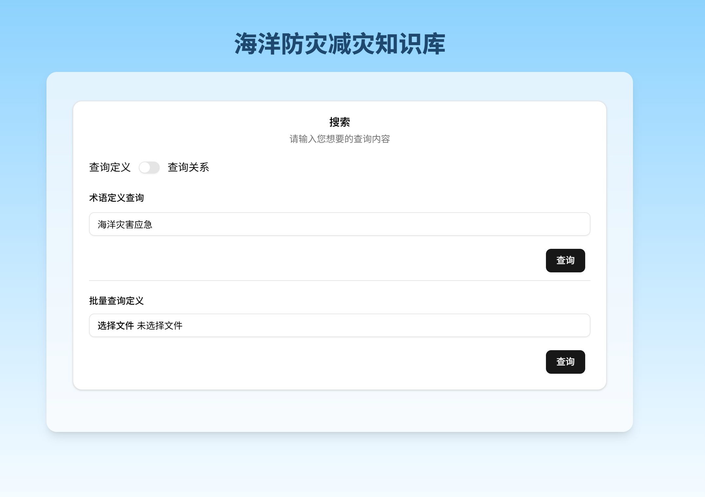
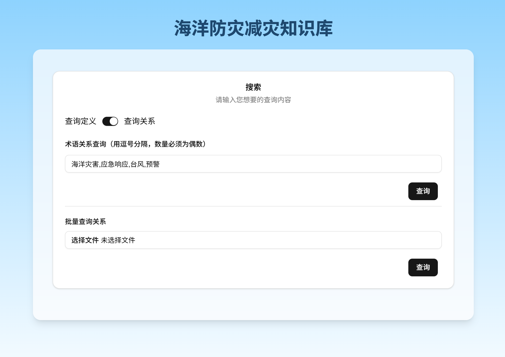

# 智绘时空海洋防灾减灾知识库设计文档

## 技术架构概述

本系统是一个基于现代技术栈构建的智能知识库问答平台，采用前后端分离架构，专门用于海洋防灾减灾相关知识的存储、检索和智能问答。

### 整体架构



### 核心技术栈

#### 后端架构

##### 1. **Web 框架 - FastAPI**
- **技术选型**: FastAPI + Python 3.12+
- **特性**: 
  - 自动API文档生成 (Swagger UI)
  - 异步支持
  - 类型注解和验证
  - CORS中间件支持

##### 2. **向量数据库 - ChromaDB**
- **功能**: 存储文档向量化后的embeddings
- **特性**:
  - 本地持久化存储
  - 高效相似度检索
  - 元数据存储和过滤

##### 3. **文档处理管道**
- **PDF解析**: PDFPlumber - 提取文本内容
- **文本分割**: LangChain RecursiveCharacterTextSplitter
- **向量化**: SiliconFlow BAAI/bge-m3 模型
- **缓存机制**: 本地文件缓存避免重复计算

##### 4. **多线程优化**
- **并行处理**: ThreadPoolExecutor实现PDF文档并行处理
- **线程安全**: 数据库写入操作使用锁机制
- **性能提升**: 2-4倍处理速度提升

#### 前端架构

##### 1. **现代React技术栈**
- **构建工具**: RSBuild
- **UI框架**: React 19.2.0
- **UI组件库**: shadcn UI + Tailwind CSS
- **状态管理**: Jotai 
- **表单处理**: React Hook Form + Zod

##### 2. **开发工具链**
- **代码规范**: Biome (代替ESLint 与 Prettier)
- **类型安全**: TypeScript 5.9+ 与 Python typing hints
- **API集成**: OpenAPI-TS自动生成API客户端对接代码

### 核心功能模块

#### 1. **智能检索模块**
```python
# 路由: /routes/search.py
- 概念定义检索 (POST /definition)
- 批量定义检索 (POST /definition/batch)
- 关系抽取 (POST /relation)
- 批量检索 (POST /search/batch)
```

#### 2. **数据处理管道**
```python
# 核心模块
database.py         # 向量数据库操作
embedding.py        # 向量化服务
service/splitter.py # 文档分割
utils/definition.py # 定义抽取
utils/relation.py   # 关系抽取
```

### 数据处理流程

#### 1. **文档入库流程**



#### 2. **智能检索流程**



#### 3. **多线程处理流程**



### 核心算法与模型

#### 1. **向量化模型**
- **模型**: BAAI/bge-m3
- **提供商**: SiliconFlow API
- **缓存策略**: 本地文件缓存避免重复调用

#### 2. **文本分割算法**
- **策略**: 递归字符分割
- **参数优化**: 
  - 块大小512字符 (平衡上下文和检索精度)
  - 重叠64字符 (保持语义连续性)

#### 3. **检索增强生成 (RAG)**
- **检索**: 基于向量相似度的语义检索
- **生成**: 结合检索结果的智能问答
- **优化**: 缓存机制提升响应速度

### 性能优化策略

#### 1. **计算性能**
- **多线程**: PDF处理并行化
- **缓存**: 向量计算结果本地缓存
- **批处理**: API调用批量化减少网络开销

#### 2. **存储优化**
- **向量数据库**: ChromaDB本地持久化
- **文件存储**: 结构化目录管理
- **元数据**: 高效的索引和过滤

#### 3. **网络优化**
- **异步处理**: FastAPI异步支持
- **CORS**: 跨域资源共享配置
- **API设计**: RESTful设计模式

### 部署架构

#### 1. **容器化部署**
```dockerfile
# Docker支持
docker-compose.yml  # 多服务编排
Dockerfile          # Python后端容器
nginx.conf          # 反向代理配置
```

#### 2. **进程管理**
```ini
# supervisord.conf
- FastAPI应用进程管理
- 自动重启机制
- 日志输出管理
```

#### 3. **监控与日志**
```python
# loguru日志系统
- 结构化日志输出
- 多级别日志管理
- 文件轮转支持
```

### 扩展性设计

#### 1. **模块化架构**
- 清晰的模块边界
- 松耦合设计
- 易于功能扩展

#### 2. **配置管理**
- 环境变量配置
- 动态参数调整
- 多环境支持

#### 3. **API设计**
- 版本化管理
- 标准化响应格式
- 自动文档生成

这个技术架构充分考虑了现代Web应用的最佳实践，在保证性能的同时提供了良好的可维护性和扩展性。

## Docker 部署指南

本项目使用 Docker 多阶段构建，基于 Debian 将 FastAPI 后端和前端打包到一个镜像中。

### 架构说明

- **基础镜像**: Debian bookworm-slim
- **前端**: React + Rsbuild，构建后的静态文件由 Nginx 提供服务
- **后端**: FastAPI + Python 3，通过 uVicorn 运行
- **反向代理**: Nginx 处理静态文件和 API 代理
- **进程管理**: Supervisor 管理 Nginx 和 FastAPI 进程

### 快速开始

#### 方法1: 使用构建脚本

```bash
./build.sh
```


#### 方法2: 使用 Docker Compose

```bash
# 构建并启动
docker-compose up --build -d

# 查看日志
docker-compose logs -f

# 停止服务
docker-compose down
```

#### 方法3: 直接使用 Docker

```bash
# 构建镜像
docker build -t knowledgebase:latest .

# 运行容器
docker run -d -p 80:80 knowledgebase
```

### 目录结构

```
/app/                   # 应用根目录
├── main.py            # FastAPI 入口
├── routes/            # API 路由
├── service/           # 业务逻辑
├── utils/             # 工具函数
├── data/              # 数据文件
├── logs/              # 日志文件
└── chroma_db/         # 数据库文件


/var/www/html/         # 前端静态文件
```

### 健康检查

容器包含健康检查机制：
- 检查间隔: 30秒
- 超时时间: 3秒
- 重试次数: 3次
- 启动期间: 5秒

### 日志查看

```bash
# 查看所有服务日志
docker-compose logs -f

# 查看特定服务日志
docker-compose logs -f kb-app

# 查看容器内部日志
docker exec -it kb-app tail -f /var/log/fastapi.log
docker exec -it kb-app tail -f /var/log/nginx/access.log
```

### 故障排除

#### 1. 容器启动失败
```bash
# 查看容器日志
docker logs kb-app

# 进入容器调试
docker exec -it kb-app /bin/bash
```

#### 2. 前端无法访问
检查 Nginx 配置和静态文件是否正确部署：
```bash
docker exec -it kb-app ls -la /var/www/html/
docker exec -it kb-app nginx -t
```

#### 3. API 无法访问
检查 FastAPI 服务状态：
```bash
docker exec -it kb-app curl http://localhost:8000/docs
docker exec -it kb-app supervisorctl status
```

## Web UI使用说明

### 术语定义查询



- 单个查询

在输入框内输入要查询的术语，点击旁边的`查询`按钮。等待片刻后即可得到查询结果。

- 批量查询

上传需要查询的`json`文件，点击旁边的`查询`按钮，即可进行批量查询。查询期间可以通过进度条查看查询进度。

`json`文件内容格式大致如下

```json
[
  "术语A",
  "术语B",
  "术语C",
  "术语D",
  ...
]
```

### 术语关系判断



- 输入判断

在输入框内输入要查询的术语列表，术语的总数量需为双数，并且术语之间要用逗号分隔。然后，点击旁边的`查询`按钮。等待片刻后即可得到两两术语见关系的查询结果。

- 批量判断

上传需要查询的`json`文件（文件内术语的总数量需为双数），点击旁边的`查询`按钮，即可进行批量查询。查询期间可以通过进度条查看查询进度。

`json`文件内容格式大致如下

```json
[
  "术语A",
  "术语B",
  "术语C",
  "术语D",
  ...
]
```
